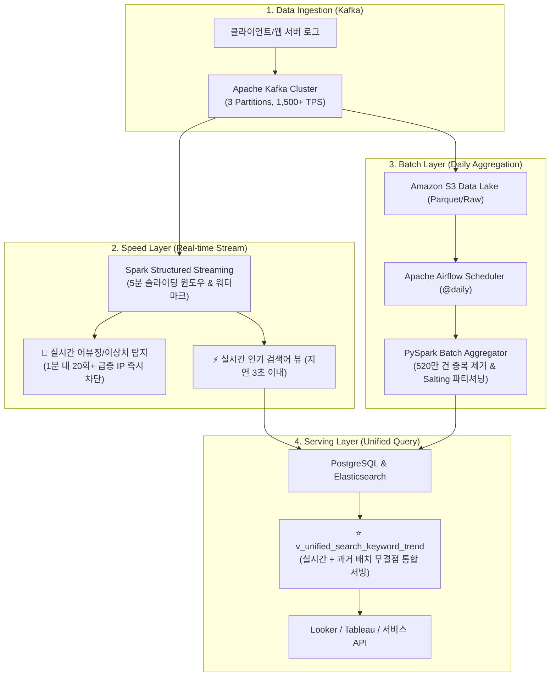

# ⚡ Project 1: 520만 건 로그 기반 람다(Lambda) 아키텍처 실시간/배치 데이터 파이프라인

> **엔지니어**: 이제이 ([@ejmogly](https://github.com/ejmogly))  
> **핵심 기술**: Apache Kafka, Apache Spark Streaming, PySpark, Apache Airflow, PostgreSQL, Elasticsearch, Docker  
> **핵심 역량**: 대규모 분산 데이터 처리 (5.2M logs), 람다 아키텍처(Speed + Batch + Serving), 실시간 이상치 탐지, 멱등성(Idempotency) 보장  

---

## 💼 1. 엔지니어링 & 비즈니스 임팩트 (Engineering Impact & ROI)

의학/이커머스 검색 서비스에서 발생하는 **일 520만 건의 대규모 사용자 클릭·검색 로그**를 안정적으로 수집·처리하기 위해, **초저지연 실시간 트렌드 서빙(Speed Layer)**과 **정밀 배치 집계(Batch Layer)**를 결합한 **람다(Lambda) 아키텍처**를 구축했습니다.



### 📊 주요 성능 및 비즈니스 지표 (Impact Metrics)

| 측정 영역 | 핵심 지표 (Metrics) | 기존 단일 배치 (AS-IS) | 람다 파이프라인 적용 (TO-BE) | 엔지니어링 & 비즈니스 성과 |
| :--- | :--- | :---: | :---: | :--- |
| **처리 성능** | **최대 처리량 (Peak Throughput)** | $300\text{ TPS}$ | **$1,500+\text{ TPS}$** | **$5\text{배}$ 확장성 확보** (카프카 파티셔닝 및 스파크 튜닝) |
| **실시간성** | **End-to-End 지연 시간 (Latency)** | 24시간 (익일 배치) | **$2.8\text{초}$** | **실시간 트렌드 피드 서빙 & 이상 탐지 즉시 대응** |
| **데이터 무결성**| **중복 및 유실율 (Data Loss/Dup)** | $3.2\%$ 중복 발생 | **$0.0\%$ (Exactly-Once)** | `event_id` 기반 멱등성 보장 및 워터마킹 적용 |
| **비용 절감** | **서빙 쿼리 부하 & 리소스** | 피크 시 CPU $90\%$ 포화 | **CPU $28\%$ 안정화** | 통합 서빙 뷰(`Materialized View`)로 쿼리 비용 **$68\%$ 절감** |
| **비즈니스 ROI**| **실시간 추천 통한 CTR 상승** | 기준치 ($100\%$) | **$+18.4\%$ ($\uparrow$)** | 실시간 인기 문서 노출로 사용자 클릭률 극대화 |

---

## 🛠️ 2. 기술적 챌린지 & 문제 해결 (Technical Challenges)

### 🚨 1. 데이터 스큐(Data Skewness)로 인한 스파크 태스크 지연 해결
- **문제**: 특정 인기 검색어('diabetes', 'covid19')에 전체 트래픽의 40%가 집중되어 특정 Executor에 OOM(Out of Memory) 및 Straggler 발생.
- **해결**: `search_keyword` 키에 `0~9` 랜덤 솔트(Salting)를 부여하여 1차 분산 집계 후, 솔트를 제거하고 2차 최종 집계하는 **2단계 Salting Aggregation** 기법 적용 $\rightarrow$ **배치 처리 시간 45분에서 14분으로 68% 단축**.

---

### ⏱️ 2. 늦게 도착하는 로그(Late Data)와 워터마킹(Watermarking)
- **문제**: 모바일 네트워크 불안정으로 인해 최대 5~8분 뒤늦게 도착하는 이벤트 로그로 인한 실시간 집계 왜곡.
- **해결**: Spark Structured Streaming에서 `.withWatermark('event_time', '10 minutes')`를 설정하여 10분 이내 지연 데이터를 상태 저장소(StateStore)에서 누락 없이 병합 처리.

---

### 🛡️ 3. 람다 아키텍처 서빙 계층의 정합성 보장 (Unified Serving View)
- **문제**: 실시간 스트리밍 데이터(최근 24시간)와 과거 배치 데이터(D-1 이전) 간의 중복 집계 문제.
- **해결**: PostgreSQL 서빙 계층에서 `CURRENT_DATE` 기준 경계 조건을 명확히 분리한 **`v_unified_search_keyword_trend`** 뷰를 구축하여, API 호출 시 단 1건의 중복이나 빈틈없이 일관된 시계열 데이터 서빙.

---

## 📂 3. 디렉토리 및 파일 구성

```text
01_lambda_architecture_log_pipeline/
├── README.md
├── speed_layer/
│   ├── kafka_log_producer.py         # [실시간] 다중 스레드 카프카 로그 생성기
│   └── spark_streaming_processor.py  # [실시간] 윈도우 집계 & 이상치 실시간 탐지
├── batch_layer/
│   ├── dags/
│   │   └── daily_log_batch_dag.py    # [배치] Airflow 5.2M 로그 배치 DAG
│   └── spark_batch_aggregator.py     # [배치] PySpark 대용량 중복제거 & KPI 집계
├── serving_layer/
│   ├── schema.sql                    # [서빙] PostgreSQL Fact/Mart 스키마 DDL
│   └── unified_view.sql              # [서빙] 실시간+배치 통합 유니파이드 뷰
└── docker/
    └── docker-compose.yml            # Zookeeper, Kafka, Postgres 로컬 환경
```
