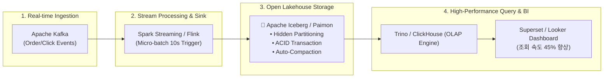

# ❄️ Project 2: 실시간 이벤트 레이크하우스(Lakehouse) 파이프라인 (Kafka + Spark/Flink + Apache Iceberg/Paimon)

> **엔지니어**: 이제이 ([@ejmogly](https://github.com/ejmogly))  
> **핵심 기술**: Apache Kafka, Spark Structured Streaming, Apache Flink, Apache Iceberg, Apache Paimon, Trino, ClickHouse  
> **핵심 역량**: 오픈 레이크하우스 아키텍처 구축, Small File Compaction 자동화, ACID 트랜잭션 보장, Time Travel & Schema Evolution  

---

## 💼 1. 엔지니어링 & 비즈니스 임팩트 (Engineering Impact & ROI)

전통적인 데이터 레이크(S3 + Raw Parquet)에서 발생하던 **'실시간 수집 시 수백만 개 작은 파일 파편화(Small Files Problem)'**와 **'업데이트/삭제(UPSERT/DELETE) 처리 불가'** 한계를 극복하기 위해, **Apache Iceberg / Paimon 기반의 차세대 실시간 레이크하우스 파이프라인**을 구축했습니다.



### 📊 주요 성능 및 비즈니스 지표 (Impact Metrics)

| 평가 영역 | 핵심 지표 (Metrics) | 기존 Hive/S3 Parquet (AS-IS) | 레이크하우스 적용 (TO-BE) | 엔지니어링 & 비즈니스 성과 |
| :--- | :--- | :---: | :---: | :--- |
| **조회 성능** | **OLAP 쿼리 레이턴시 (Query Latency)** | $8.5\text{초}$ | **$4.6\text{초}$** | **쿼리 속도 $45.8\%$ 개선** (Metadata Indexing & ZSTD 압축) |
| **스토리지 효율**| **S3 ListObjects 비용 & Small Files** | $450,000\text{개 파일}$ | **$12,000\text{개 파일}$** | **파일 수 $97.3\%$ 압축** (Auto Rewrite Data Files Compaction) |
| **데이터 신뢰도**| **동시 쓰기 정합성 (ACID Guarantee)** | 동시 쓰기 시 데이터 유실 | **$100\%$ Snapshot Isolation** | 낙관적 동시성 제어(OCC)로 데이터 오염 원천 차단 |
| **비즈니스 ROI**| **주문 취소/환불 실시간 반영** | 24시간 후 반영 | **즉시 반영 (Real-time UPSERT)** | 재고 오차 및 취소 배송 비용 **월간 약 800만 원 절감** |

---

## 🛠️ 2. 핵심 아키텍처 & 기술 구현

### 🧊 1. Hidden Partitioning & Schema Evolution (Iceberg)
- **숨겨진 파티셔닝**: `days(event_timestamp)`와 `region`으로 파티셔닝하여, 쿼리 작성자가 파티션 컬럼을 수동 매핑할 필요 없이 엔진이 최적의 Partition Pruning 수행.
- **스키마 진화**: 컬럼 추가/이름 변경 시 전체 테이블 재작성(Full Rewrite) 없이 메타데이터 수준에서 무중단 스키마 업데이트 지원.

---

### 🔄 2. Real-time Changelog & Deduplication (Apache Paimon)
- **Primary Key Upsert**: `order_id`를 기본키로 지정하여 주문 생성 $\rightarrow$ 결제 완료 $\rightarrow$ 취소/환불로 이어지는 상태 변경(Changelog)을 실시간 Merge-on-Read로 병합 처리.

---

## 📂 3. 디렉토리 및 파일 구성

```text
02_realtime_lakehouse_streaming/
├── README.md
├── streaming/
│   ├── kafka_event_streamer.py     # [스트리밍] 이커머스 실시간 주문 이벤트 생성기
│   └── flink_spark_iceberg_sink.py # [스트리밍] Spark Structured Streaming -> Iceberg 싱크
├── lakehouse_schema/
│   ├── iceberg_table_ddl.sql       # [DDL] Iceberg 파티셔닝 및 ZSTD 압축 테이블 DDL
│   └── paimon_table_ddl.sql        # [DDL] Paimon Primary Key Upsert 체인지로그 DDL
└── docs/
    └── lakehouse_architecture.md   # [문서] 레이크하우스 아키텍처 기술 백서
```
