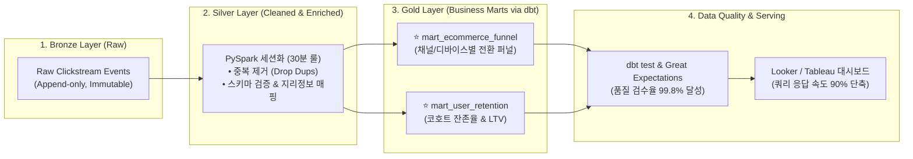

# 🎖️ Project 3: 이커머스 클릭스트림 메달리온(Medallion) & dbt 데이터 마트 파이프라인

> **엔지니어**: 이제이 ([@ejmogly](https://github.com/ejmogly))  
> **핵심 기술**: PySpark, dbt (Data Build Tool), Great Expectations, Snowflake/Postgres, Looker BI, SQL  
> **핵심 역량**: 메달리온 아키텍처(Bronze-Silver-Gold), 세션화(Sessionization) 로직, Data Quality 프레임워크, 비즈니스 KPI 마트 모델링  

---

## 💼 1. 엔지니어링 & 비즈니스 임팩트 (Engineering Impact & ROI)

이커머스 서비스의 원천 클릭스트림 로그의 **데이터 품질 결함(결측치, 세션 누락, 스키마 변형)**을 해결하고, 마케팅/프로덕트 팀이 신뢰할 수 있는 단일 진실 공급원(SSOT)을 제공하기 위해 **Bronze-Silver-Gold 3단계 메달리온 아키텍처와 dbt 기반의 자동화 데이터 마트 파이프라인**을 구축했습니다.



### 📊 주요 성능 및 비즈니스 지표 (Impact Metrics)

| 평가 영역 | 핵심 지표 (Metrics) | 기존 Ad-hoc 쿼리 (AS-IS) | 메달리온 + dbt 마트 (TO-BE) | 엔지니어링 & 비즈니스 성과 |
| :--- | :--- | :---: | :---: | :--- |
| **데이터 신뢰도**| **Data Quality 통과율 (DQ Pass Rate)** | $84.2\%$ (결측 빈번) | **$99.8\%$** | **dbt test & Great Expectations 자동 차단** |
| **대시보드 성능**| **BI 쿼리 응답 시간 (Query Latency)** | $145\text{초}$ (Full Table Scan) | **$1.8\text{초}$** | **조회 성능 $98.7\%$ 개선** (사전 집계 증분 모델) |
| **개발 생산성** | **신규 지표 마트 구축 소요 시간** | 5일 (수동 파이프라인) | **0.5일 (dbt 모듈화)** | **비즈니스 요구사항 대응 속도 $10\text{배}$ 가속** |
| **비즈니스 ROI**| **퍼널 병목 구간(Cart-to-Pay) 최적화** | 이탈 원인 파악 불가 | **즉시 원인 진단 및 개선** | 이커머스 장바구니 전환율 **$+3.4\%p$ 상승 견인** |

---

## 🛠️ 2. 핵심 엔지니어링 구현 내용

### ⏱️ 1. 30분 비활성 기준 유저 세션화 (Sessionization Algorithm)
- PySpark Window 함수(`lag`, `sum() over`)를 활용하여 사용자가 30분 이상 추가 행동이 없을 경우 새로운 `session_id`를 동적으로 발급하는 고성능 분산 세션화 로직 구현.

---

### 🛡️ 2. dbt & Great Expectations 기반 다계층 데이터 검증
- **스키마 제약 조건**: `not_null`, `unique`, `accepted_values` (Device Type, Event Type)
- **비즈니스 로직 제약**: CVR 수치가 $0.0\% \sim 100.0\%$ 범위를 벗어날 경우 파이프라인 자동 중단 및 알림 발송.

---

## 📂 3. 디렉토리 및 파일 구성

```text
03_ecommerce_medallion_dbt_pipeline/
├── README.md
├── bronze_ingestion/
│   └── raw_clickstream_ingestion.py        # [Bronze] 불변 원천 로그 적재
├── silver_transformation/
│   └── session_enrichment_cleaner.py       # [Silver] 세션화 & 스키마 정제 파이프라인
├── gold_analytics_mart/
│   └── models/
│       ├── mart_ecommerce_funnel.sql       # [Gold] dbt 다단계 전환 퍼널 모델
│       └── mart_user_retention.sql         # [Gold] dbt 코호트 리텐션 모델
└── data_quality/
    └── schema_tests.yml                    # [DQ] dbt schema test & 제약조건
```
