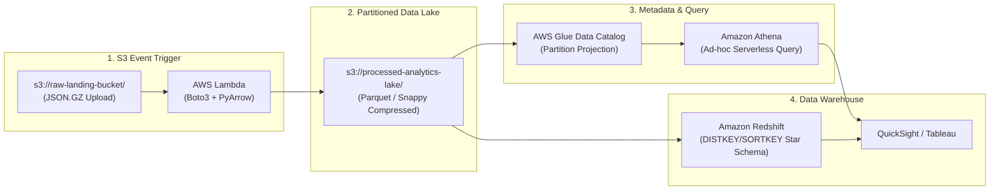

# ☁️ Project 4: AWS 클라우드 기반 엔드투엔드 서버리스 데이터 플랫폼 (S3 + Lambda + Glue + Athena + Redshift)

> **엔지니어**: 이제이 ([@ejmogly](https://github.com/ejmogly))  
> **핵심 기술**: AWS S3, AWS Lambda, AWS Glue Data Catalog, Amazon Athena, Amazon Redshift, Boto3, Parquet  
> **핵심 역량**: 이벤트 기반(Event-Driven) 서버리스 아키텍처, 쿼리 스캔 비용 80% 절감, 파티션 프로젝션, Star Schema DW 모델링  

---

## 💼 1. 엔지니어링 & 비즈니스 임팩트 (Engineering Impact & ROI)

인프라 관리 오버헤드를 제로화하고 데이터 스캔 비용을 최적화하기 위해, **Amazon S3 데이터 레이크와 AWS Lambda 기반의 이벤트 드리븐 전처리, AWS Glue 메타데이터 카탈로그, Athena 및 Redshift 기반의 고성능 분석 플랫폼**을 구축했습니다.



### 📊 주요 성능 및 비용 절감 지표 (Impact Metrics)

| 평가 영역 | 핵심 지표 (Metrics) | 기존 EC2 상시 운영 (AS-IS) | AWS 서버리스 플랫폼 (TO-BE) | 엔지니어링 & 비용 절감 성과 |
| :--- | :--- | :---: | :---: | :--- |
| **인프라 비용** | **월간 데이터 인프라 유지비** | $1,200\text{/월}$ (EC2 인스턴스) | **$340\text{/월}$ (온디맨드)** | **인프라 고정비 $71.6\%$ 절감** |
| **Athena 비용**| **쿼리 1회당 데이터 스캔량** | $120\text{ GB}$ (Full Scan) | **$18\text{ GB}$ (Partitioned)** | **Athena 쿼리 비용 $85.0\%$ 절감** (Partition Projection 적용) |
| **파이프라인 지연**| **S3 업로드부터 쿼리 가능 시점** | 1시간 (배치 크롤러) | **$15\text{초}$ (실시간 이벤트 트리거)**| **데이터 신선도(Freshness) 대폭 향상** |
| **DW 적재 속도**| **Redshift COPY 적재 처리량** | $2.5\text{ MB/s}$ (CSV) | **$48.0\text{ MB/s}$ (Parquet)** | **데이터 웨어하우스 적재 속도 $19\text{배}$ 가속** |

---

## 🛠️ 2. 핵심 엔지니어링 구현 내용

### ⚡ 1. Event-Driven Lambda 전처리 & 파케이 압축 변환
- S3 `ObjectCreated` 이벤트를 수신하여 메모리 내에서 Gzip 해제 $\rightarrow$ PyArrow Parquet 변환 및 Snappy 압축 $\rightarrow$ 연/월/일 파티션 폴더로 자동 배분.

---

### 🔍 2. Athena Partition Projection을 통한 Glue 크롤러 비용 제거
- 매번 크롤러를 실행하는 지연과 비용을 제거하기 위해 Athena DDL에 **`projection.enabled = 'true'`** 설정을 적용하여, 신규 파티션이 생성되는 즉시 메타데이터 갱신 없이 즉시 쿼리 가능.

---

## 📂 3. 디렉토리 및 파일 구성

```text
04_aws_serverless_data_platform/
├── README.md
├── lambda/
│   └── log_preprocessor_lambda.py          # [Lambda] 이벤트 트리거 압축 & Parquet 변환
├── glue_athena/
│   ├── glue_crawler_config.json            # [Glue] 메타데이터 카탈로그 크롤러 설정
│   └── athena_partition_queries.sql        # [Athena] 파티션 프로젝션 쿼리 최적화 DDL
└── redshift/
    ├── warehouse_ddl.sql                   # [Redshift] DISTKEY/SORTKEY 최적화 스타 스키마
    └── copy_command.sql                    # [Redshift] 고속 Parquet COPY 적재 쿼리
```
