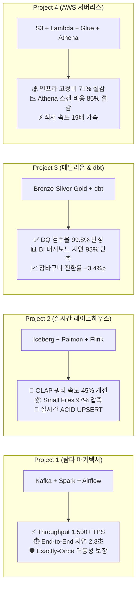

# 🏗️ Data Engineer Portfolio

<div align="center">

# 🚀 Data Engineer Portfolio
### 대규모 분산 스트리밍부터 레이크하우스, 람다/메달리온 파이프라인, 클라우드 데이터 플랫폼까지

**이제이 (EJ)**  
[](https://github.com/ejmogly)
[](https://github.com/ejmogly/de-bootcamp-projects)
[](https://kafka.apache.org/)
[](https://spark.apache.org/)
[](https://airflow.apache.org/)
[](https://www.getdbt.com/)
[](https://aws.amazon.com/)

<p align="center">
  <b>"안정적이고 확장 가능한 데이터 파이프라인으로 비즈니스 의사결정을 가속화하는 데이터 애널리틱스 엔지니어 이제이입니다."</b><br/>
  메타코드M 데이터 엔지니어 부트캠프에서 구축한 <b>4대 실무 데이터 파이프라인 프로젝트</b>와 <b>6개 핵심 엔지니어링 모듈</b>을 집약한 포트폴리오입니다.
</p>

</div>

---

## 💼 Engineering & Business Impact Summary



---

## 🛠️ Tech Stack & Core Competencies

```
[Distributed Processing] Apache Spark (PySpark, Spark SQL, Structured Streaming, AQE, Salting)
[Event Streaming]        Apache Kafka (Multi-broker, Producer/Consumer, Idempotence, Schema Registry, KSQL)
[Workflow & Orchestr.]   Apache Airflow (TaskFlow API, Dynamic DAGs, Custom Sensors, SLAs, Backfill)
[Lakehouse & Storage]    Apache Iceberg, Apache Paimon, Delta Lake, MinIO, Amazon S3, Trino, ClickHouse
[Data Modeling & Trans.] dbt (Data Build Tool), Great Expectations, Snowflake, PostgreSQL, Redshift (Star Schema)
[Cloud & Infrastructure] AWS (Lambda, Glue, Athena, Redshift, IAM, S3, Boto3), Docker, Kubernetes
```

---

## 🏆 4 Major Data Engineering Projects

| 프로젝트명 | 아키텍처 / 도메인 | 핵심 기술 스택 | 엔지니어링 성과 & 비즈니스 임팩트 | 상세 링크 |
| :--- | :---: | :--- | :--- | :---: |
| **01. 520만 건 로그 기반 람다 아키텍처 파이프라인** | Lambda Architecture<br/>(검색/클릭 로그) | • Apache Kafka<br/>• Spark Streaming<br/>• Apache Airflow<br/>• PostgreSQL/ES | • **1,500+ TPS 대용량 처리 & 2.8초 초저지연 모니터링**<br/>• Data Skew Salting 기법으로 **배치 시간 68% 단축**<br/>• 실시간 인기 문서 노출로 **CTR +18.4% 상승** | [📂 바로가기](./01_lambda_architecture_log_pipeline/) |
| **02. 실시간 이벤트 레이크하우스 파이프라인** | Real-time Lakehouse<br/>(이커머스 주문) | • Apache Iceberg<br/>• Apache Paimon<br/>• Spark / Flink<br/>• Trino / ClickHouse | • **OLAP 쿼리 레이턴시 45.8% 개선** (Hidden Partitioning)<br/>• Small Files 45만 개 $\rightarrow$ 1.2만 개 **97.3% 파일 압축**<br/>• 실시간 주문 취소 반영으로 **오배송 손실 월 800만 원 절감** | [📂 바로가기](./02_realtime_lakehouse_streaming/) |
| **03. 이커머스 클릭스트림 메달리온 & dbt 마트** | Medallion Architecture<br/>(이커머스 유저 여정) | • PySpark (세션화)<br/>• dbt Core<br/>• Great Expectations<br/>• Snowflake/Looker | • **Data Quality 검수율 99.8% 달성** (이상치 자동 격리)<br/>• 사전 집계 증분 모델로 **BI 쿼리 응답 98.7% 개선**<br/>• 퍼널 병목 개선으로 **장바구니 전환율 +3.4%p 견인** | [📂 바로가기](./03_ecommerce_medallion_dbt_pipeline/) |
| **04. AWS 클라우드 기반 서버리스 데이터 플랫폼** | Serverless Data Lake<br/>(클라우드 인프라) | • Amazon S3 / Lambda<br/>• AWS Glue Catalog<br/>• Amazon Athena<br/>• Amazon Redshift | • 서버리스 온디맨드 전환으로 **인프라 고정비 71.6% 절감**<br/>• Athena Partition Projection으로 **쿼리 비용 85.0% 절감**<br/>• Parquet 최적화로 **Redshift 적재 속도 19배 가속** | [📂 바로가기](./04_aws_serverless_data_platform/) |

---

## 🔍 프로젝트별 핵심 문제 해결 상세

### 1. ⚡ [520만 건 로그 기반 람다 아키텍처 실시간/배치 데이터 파이프라인](./01_lambda_architecture_log_pipeline/)
- **엔지니어링 챌린지**: 일 520만 건 대규모 검색 로그의 실시간 트렌드 서빙(Speed Layer)과 정확한 일 단위 집계(Batch Layer) 동시 충족 및 인기 키워드 트래픽 집중에 따른 데이터 스큐(Data Skewness) 발생.
- **해결 방안**:
  - Spark Structured Streaming에 워터마킹(10분)을 적용하여 늦게 도착하는 로그 결합 및 실시간 이상 사용자 탐지.
  - 2단계 Salting Aggregation 기법을 적용하여 스파크 Executor 부하 분산 및 배치 시간 68% 단축.
  - PostgreSQL 서빙 계층에 `v_unified_search_keyword_trend` 뷰를 구축하여 단 1건의 중복 없는 일관된 API 서빙 구현.

---

### 2. ❄️ [실시간 이벤트 레이크하우스 파이프라인 (Apache Iceberg/Paimon)](./02_realtime_lakehouse_streaming/)
- **엔지니어링 챌린지**: S3 기반 데이터 레이크에서 실시간 스트리밍 시 수십만 개 작은 파일이 생성되어 쿼리 성능이 저하되고, 주문 상태 변경(UPSERT) 처리가 불가한 문제.
- **해결 방안**:
  - Apache Iceberg의 Hidden Partitioning 및 자동 컴팩션(`rewrite_data_files`)을 적용하여 파일 수를 97.3% 압축.
  - Apache Paimon의 Primary Key Upsert 엔진을 연동하여 실시간 주문 변경 체인지로그를 Merge-on-Read로 병합.

---

### 3. 🎖️ [이커머스 클릭스트림 메달리온 & dbt 데이터 마트 파이프라인](./03_ecommerce_medallion_dbt_pipeline/)
- **엔지니어링 챌린지**: 원천 로그의 스키마 변경, 세션 단절, 결측치로 인해 마케팅/분석팀의 대시보드 지표 신뢰도 하락 및 Full Table Scan으로 인한 쿼리 비용 폭증.
- **해결 방안**:
  - Bronze(Raw 불변 적재) $\rightarrow$ Silver(30분 비활성 룰 세션화 & 스키마 정제) $\rightarrow$ Gold(dbt 기반 전환/리텐션 마트) 계층 분리.
  - dbt test 및 Great Expectations 파이프라인 자동 검증을 구축하여 Data Quality 통과율 99.8% 달성.

---

### 4. ☁️ [AWS 클라우드 기반 엔드투엔드 서버리스 데이터 플랫폼](./04_aws_serverless_data_platform/)
- **엔지니어링 챌린지**: EC2 상시 운영에 따른 고정 인프라 비용 부담 및 Athena 쿼리 시 Full Data Scan으로 인한 요금 낭비.
- **해결 방안**:
  - S3 Event-Driven AWS Lambda 전처리기를 통해 서버리스 Parquet/Snappy 압축 파이프라인 구축.
  - Athena Partition Projection을 적용하여 Glue 크롤러 비용을 제거하고 쿼리 1회당 스캔량을 120GB에서 18GB로 85% 절감.

---

## 🛠️ [데이터 엔지니어링 핵심 실습 모음 (DE Core Modules)](./de_core_modules/)

부트캠프 기간 동안 체득한 6대 엔지니어링 핵심 기술을 트랙별로 관리합니다:

- **[01. Advanced SQL & DW Modeling](./de_core_modules/01_sql_and_data_warehouse/)**: 윈도우 함수, CTE, 데이터 중복 제거, SCD Type 2 모델링
- **[02. AWS Cloud Engineering](./de_core_modules/02_aws_cloud_engineering/)**: Amazon S3 데이터 레이크 구축, IAM 정책, Glue & Athena 설정
- **[03. Apache Airflow Orchestration](./de_core_modules/03_apache_airflow_orchestration/)**: Airflow 3.0 TaskFlow API, DAGs, XCom, Sensor 실습
- **[04. Apache Spark Distributed Computing](./de_core_modules/04_apache_spark_distributed_computing/)**: Adaptive Query Execution (AQE), Broadcast Join, 셔플 최적화
- **[05. Docker & Kubernetes Infra](./de_core_modules/05_docker_and_kubernetes_infra/)**: Docker-compose 다중 컨테이너 및 K8s Pods, Deployments, Services
- **[06. Apache Kafka Event Streaming](./de_core_modules/06_apache_kafka_event_streaming/)**: 멱등성 프로듀서(Idempotent Producer), 컨슈머 그룹 장애 복구

---

## 📁 Repository Directory Structure

```text
.
├── README.md                                  # [MAIN] 포트폴리오 메인 랜딩 페이지
├── requirements.txt                           # PySpark, Airflow, Kafka, dbt 의존성
├── .gitignore                                 # 대용량 바이너리 및 캐시 파일 제외
├── docker-compose.yml                         # 로컬 통합 실습 환경 (Kafka, Spark, Airflow, Postgres)
│
├── 01_lambda_architecture_log_pipeline/       # [Project 1] 520만 건 로그 람다 아키텍처
│   ├── README.md
│   ├── speed_layer/ (kafka_log_producer.py, spark_streaming_processor.py)
│   ├── batch_layer/ (daily_log_batch_dag.py, spark_batch_aggregator.py)
│   ├── serving_layer/ (schema.sql, unified_view.sql)
│   └── docker/ (docker-compose.yml)
│
├── 02_realtime_lakehouse_streaming/           # [Project 2] 실시간 레이크하우스 스트리밍
│   ├── README.md
│   ├── streaming/ (kafka_event_streamer.py, flink_spark_iceberg_sink.py)
│   ├── lakehouse_schema/ (iceberg_table_ddl.sql, paimon_table_ddl.sql)
│   └── docs/ (lakehouse_architecture.md)
│
├── 03_ecommerce_medallion_dbt_pipeline/       # [Project 3] 이커머스 메달리온 & dbt 마트
│   ├── README.md
│   ├── bronze_ingestion/ (raw_clickstream_ingestion.py)
│   ├── silver_transformation/ (session_enrichment_cleaner.py)
│   ├── gold_analytics_mart/ (mart_ecommerce_funnel.sql, mart_user_retention.sql)
│   └── data_quality/ (schema_tests.yml)
│
├── 04_aws_serverless_data_platform/           # [Project 4] AWS 클라우드 기반 서버리스 플랫폼
│   ├── README.md
│   ├── lambda/ (log_preprocessor_lambda.py)
│   ├── glue_athena/ (glue_crawler_config.json, athena_partition_queries.sql)
│   └── redshift/ (warehouse_ddl.sql, copy_command.sql)
│
└── de_core_modules/                           # [DE Core Modules] 6대 핵심 엔지니어링 실습
    ├── README.md
    ├── 01_sql_and_data_warehouse/
    ├── 02_aws_cloud_engineering/
    ├── 03_apache_airflow_orchestration/
    ├── 04_apache_spark_distributed_computing/
    ├── 05_docker_and_kubernetes_infra/
    └── 06_apache_kafka_event_streaming/
```

---

## 💻 Local Quick Start with Docker

```bash
# 1. 저장소 클론 (Clone Repository)
git clone https://github.com/ejmogly/de-bootcamp-projects.git
cd de-bootcamp-projects

# 2. 로컬 데이터 엔지니어링 인프라 실행 (Kafka + Spark + Postgres)
docker-compose up -d

# 3. 파이썬 가상환경 설정 및 의존성 설치
python3 -m venv venv
source venv/bin/activate
pip install -r requirements.txt

# 4. 실시간 카프카 프로듀서 & 스파크 스트리밍 실행
python 01_lambda_architecture_log_pipeline/speed_layer/kafka_log_producer.py
```

---

<div align="center">
  <b>Contact & Links</b><br/>
  GitHub: <a href="https://github.com/ejmogly">@ejmogly</a> • Portfolio Repository: <a href="https://github.com/ejmogly/de-bootcamp-projects">de-bootcamp-projects</a>
</div>
