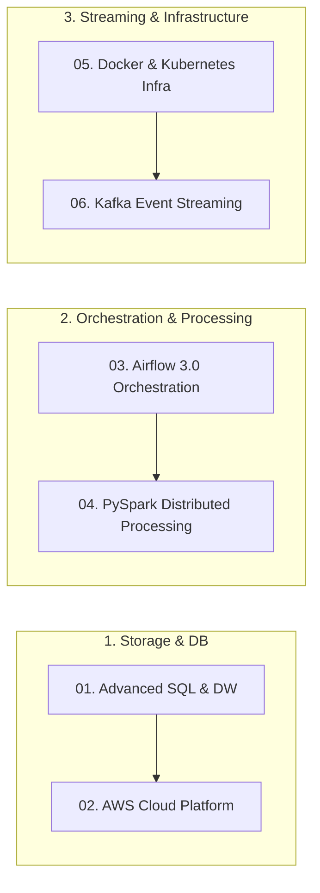

# 🛠️ Data Engineering Core Modules (Curriculum & Hands-on Labs)

> **엔지니어**: 이제이 ([@ejmogly](https://github.com/ejmogly))  
> **구성**: 부트캠프 기간 동안 학습한 6대 엔지니어링 핵심 기술 트랙의 실습 코드 및 아키텍처 명세  

---

## 🗺️ 엔지니어링 커리큘럼 & 기술 매트릭스

---

## 📂 트랙별 상세 내용 및 파일 목록

1. **[01_sql_and_data_warehouse/](./01_sql_and_data_warehouse/)**: 윈도우 함수, CTE, 데이터 중복 제거, SCD Type 2 모델링
2. **[02_aws_cloud_engineering/](./02_aws_cloud_engineering/)**: Amazon S3 데이터 레이크 구축, IAM 정책, Glue & Athena 설정
3. **[03_apache_airflow_orchestration/](./03_apache_airflow_orchestration/)**: Airflow 3.0 TaskFlow API, DAGs, XCom, Sensor 실습
4. **[04_apache_spark_distributed_computing/](./04_apache_spark_distributed_computing/)**: Adaptive Query Execution (AQE), Broadcast Join, 셔플 최적화
5. **[05_docker_and_kubernetes_infra/](./05_docker_and_kubernetes_infra/)**: Docker-compose 다중 컨테이너 및 K8s Pods, Deployments, Services
6. **[06_apache_kafka_event_streaming/](./06_apache_kafka_event_streaming/)**: 멱등성 프로듀서(Idempotent Producer), 컨슈머 그룹 장애 복구
